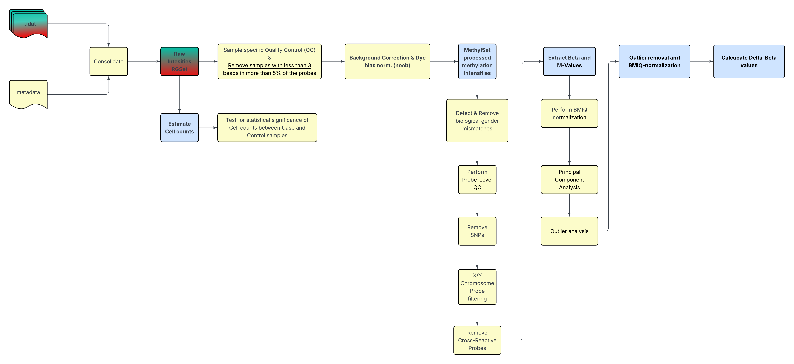

# A Minfi-powered Methylation Analysis Pipeline

------------------------------------------------------------------------

A currently (Dec. 2025/Jan. 2026) WIP on a minfi based pipeline for pre-processing, exploratory- and differential analysis of methylation data.\
While creating the code the GEO dataset GSE111629[^readme-1] was used. The source code was partially created by using AI tools[^readme-2]. In order to test the workflow on an additional dataset, GSE165082[^readme-3] was used.

[^readme-1]: Horvath S, Ritz BR. Increased epigenetic age and granulocyte counts in the blood of Parkinson's disease patients. Aging (Albany NY). 2015 Dec;7(12):1130-42. doi: 10.18632/aging.100859. PMID: 26655927; PMCID: PMC4712337.

[^readme-2]: DeepSeek. (2024). DeepSeek AI assistant (Version 2024) [Computer software]. <https://www.deepseek.com>

[^readme-3]: Henderson AR, Wang Q, Meechoovet B, Siniard AL et al. DNA Methylation and Expression Profiles of Whole Blood in Parkinson's Disease. Front Genet 2021;12:640266. PMID: 33981329

## 1. Pre-processing

Pre-processing involves outlier detection and removal and further measures, like SNPs, X/Y-chromosome located probes and Cross-reactive probe removal and also removal of biological-gender mismatched samples. Other than than background correction and dye-bias normalization via noob and Beta-Mixture Quantile (BMIQ) Normalization is performed during the pre-processing stage.

