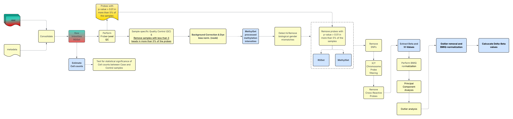

# A Minfi-powered Methylation Analysis Pipeline

------------------------------------------------------------------------

A currently (Dec. 2025/Jan. 2026) WIP on a minfi based pipeline for pre-processing, exploratory- and differential analysis of methylation data.\
While creating the code the GEO dataset GSE111629[^readme-1] was used. The source code was partially created by using AI tools[^readme-2]. In order to test the workflow on an additional dataset, GSE165082[^readme-3] was used. Adjustments for EPIC Methylation Array data analysis were tested by using the PPMI's Project 120 dataset[^readme-4]. Furthermore, the GEO dataset GSE145361 was used [^readme-5]

[^readme-1]: Horvath S, Ritz BR. Increased epigenetic age and granulocyte counts in the blood of Parkinson's disease patients. Aging (Albany NY). 2015 Dec;7(12):1130-42. doi: 10.18632/aging.100859. PMID: 26655927; PMCID: PMC4712337.

[^readme-2]: DeepSeek. (2024). DeepSeek AI assistant (Version 2024) [Computer software]. <https://www.deepseek.com>

[^readme-3]: Henderson AR, Wang Q, Meechoovet B, Siniard AL et al. DNA Methylation and Expression Profiles of Whole Blood in Parkinson's Disease. Front Genet 2021;12:640266. PMID: 33981329

[^readme-4]: Data used in the preparation of this article was obtained on 2025-03-01 from the Parkinson’s Progression Markers Initiative (PPMI) database (www.ppmi-info.org/access-data-specimens/download-data), RRID:SCR_006431. For up-to-date information on the study, visit www.ppmi-info.org. PPMI–a public-private partnership–is funded by the Michael J. Fox Foundation for Parkinson’s Research, and funding partners, including 4D Pharma, Abbvie, AcureX, Allergan, Amathus Therapeutics, Aligning Science Across Parkinson’s, AskBio, Avid Radiopharmaceuticals, BIAL, Biogen, Biohaven, BioLegend, BlueRock Therapeutics, Bristol‐Myers Squibb, Calico Labs, Celgene, Cerevel Therapeutics, Coave Therapeutics, DaCapo Brainscience, Denali, Edmond J. Safra Foundation, Eil Lilly, GE Healthcare, Genentech, GSK, Golub Capital, Gain Therapeutics, Handl Therapeutics, Insitro, Janssen Neuroscience, Lundbeck, Merck, Meso Scale Discovery, Mission Therapeutics, Neurocrine Biosciences, Pfizer, Piramal, Prevail Therapeutics, Roche, Sanofi, Servier, Sun Pharma Advanced Research Company, Takeda, Teva, UCB, Vanqua Bio, Verily, Voyager Therapeutics, the Weston Family Foundation and Yumanity Therapeutics.

[^readme-5]: Vallerga CL, Zhang F, Fowdar J, McRae AF et al. Analysis of DNA methylation associates the cystine-glutamate antiporter SLC7A11 with risk of Parkinson's disease. Nat Commun 2020 Mar 6;11(1):1238. PMID: 32144264

## 1. Pre-processing

Pre-processing involves sample- and probe QC, outlier detection and removal and further measures, like SNPs, X/Y-chromosome located probes and Cross-reactive probe removal and also removal of biological-gender mismatched samples. Other than that, background correction and dye-bias normalization via noob and Beta-Mixture Quantile (BMIQ) Normalization is performed during the pre-processing stage.  
Additionally, cell count estimates are retrieved as the last stage of pre-processing and the results exported as csv and visualized as boxplots, together with statistical testing across the respective study groups according to FDR and Bonferroni correction.

Regarding QC, probes with p-value > 0.01 in more than 5% of the samples are removed. Samples with mean intensities below a threshold (empirical) of 10.5 are removed. Also, samples where bisulfite conversion of channel I and II probes while those were removed which fall below a threshold value, calculated by 2 standard deviations below the mean. Additionally, samples with less than 3 beads in more than 5% of probes are excluded as well.

